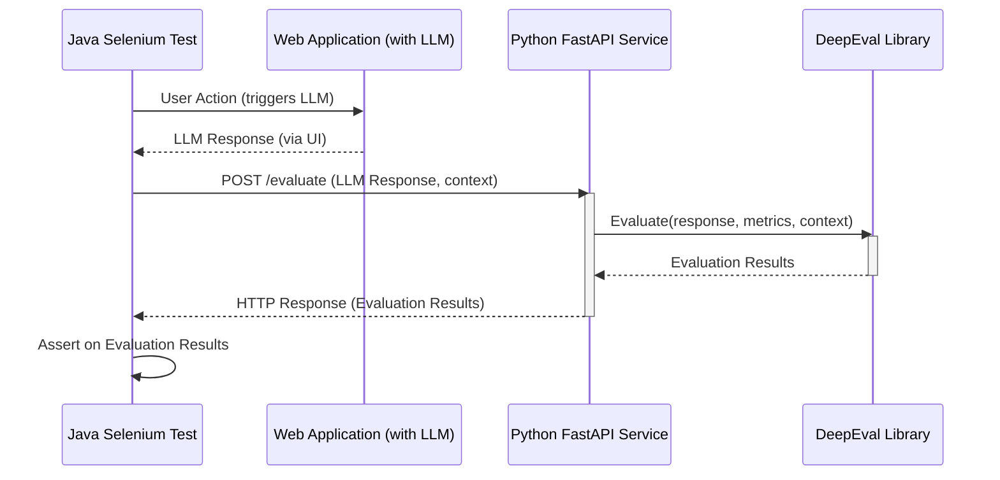

Okay, no problem! Let's adjust the Java-specific parts of the README for Gradle.

Here's the updated README reflecting Gradle usage:

```markdown
# LLM-Response-Enhanced Selenium Testing Framework

This project demonstrates a framework for extending Java Selenium UI tests to evaluate the responses of a Large Language Model (LLM) embedded within an application. It uses FastAPI as a bridge to send LLM responses from Java to a Python environment where [DeepEval](https://github.com/confident-ai/deepeval) performs the evaluation.

## The Problem
Traditional UI testing with Selenium excels at verifying user interface behavior and flow. However, when applications integrate LLMs, simply checking if a response *exists* isn't enough. We need to assess the *quality*, *relevance*, *accuracy*, and other nuanced aspects of the LLM's output.

This framework addresses that gap by:
1.  Leveraging Java Selenium for standard UI interactions.
2.  Capturing the LLM response generated by the application under test.
3.  Sending this response to a Python service via FastAPI.
4.  Utilizing DeepEval in Python to perform sophisticated evaluations on the LLM response.
5.  Returning evaluation results back to the Java test for assertions.

## Architecture

The testing flow is as follows:

1.  **Java Selenium Test Execution**:
    *   A Java test using Selenium WebDriver interacts with your web application.
    *   The test triggers an action in the application that elicits a response from its integrated LLM.
    *   The Java test captures the LLM's textual response from the UI.

2.  **Communication via FastAPI**:
    *   The Java test makes an HTTP POST request (e.g., using OkHttp, Apache HttpClient, or Java's built-in HttpClient) to a FastAPI endpoint running in a Python environment.
    *   The request payload includes the LLM response and any necessary context or expected outputs for evaluation.

3.  **Python & DeepEval Evaluation**:
    *   The FastAPI endpoint receives the LLM response.
    *   A Python script uses DeepEval to evaluate the response against defined metrics (e.g., G-Eval, Hallucination, Answer Relevancy, Bias, etc.).
    *   DeepEval processes the response and generates evaluation scores/results.

4.  **Results Feedback**:
    *   The FastAPI service sends the DeepEval evaluation results back to the Java client as an HTTP response.

5.  **Assertion in Java Test**:
    *   The Java test receives the evaluation results.
    *   Assertions are made based on these results (e.g., checking if the G-Eval score is above a certain threshold, or if the hallucination score is below a limit).



## Key Features

*   **Combines UI and LLM Testing**: Extends familiar Selenium tests with powerful LLM evaluation capabilities.
*   **Leverages DeepEval**: Utilizes a specialized Python library for robust and diverse LLM evaluation metrics.
*   **Inter-language Communication**: Uses FastAPI for seamless communication between Java and Python.
*   **Modular Design**: Keeps UI interaction logic in Java and LLM evaluation logic in Python.
*   **Extensible**: Easily add new DeepEval metrics or custom evaluation logic in the Python service.

## Prerequisites

*   **Java Development Kit (JDK)**: Version 11+ (or as required by your Selenium project)
*   **Gradle**: For Java project dependency management and building.
*   **Python**: Version 3.8+
*   **pip**: Python package installer.
*   **Web Browser**: Chrome, Firefox, etc.
*   **WebDriver**: ChromeDriver, GeckoDriver, etc., compatible with your browser and Selenium version.
*   **(Optional) DeepEval API Key**: If using certain DeepEval features that require it (e.g., for G-Eval with specific models).

## Project Structure (Suggested)

```
.
├── java_selenium_module/
│   ├── src/
│   │   ├── main/java/      # Optional helper classes
│   │   └── test/java/      # Your Selenium test classes
│   │       └── com/example/tests/
│   │           └── LLMAppTests.java
│   ├── build.gradle        # Gradle build script (or build.gradle.kts for Kotlin DSL)
│   ├── gradle/wrapper/     # Gradle wrapper files
│   ├── gradlew             # Gradle wrapper script (Linux/macOS)
│   ├── gradlew.bat         # Gradle wrapper script (Windows)
│   └── webdrivers/         # (Optional) local webdrivers
│
├── python_deepeval_service/
│   ├── app/
│   │   ├── main.py         # FastAPI application
│   │   ├── models.py       # Pydantic models for request/response
│   │   └── evaluator.py    # DeepEval logic
│   ├── tests/              # (Optional) Python unit tests for the service
│   ├── requirements.txt    # Python dependencies
│   └── .env                # (Optional) For API keys, etc.
│
└── README.md
```

## Setup and Installation

### 1. Python DeepEval Service

Navigate to the `python_deepeval_service` directory:
```bash
cd python_deepeval_service
```

Create and activate a virtual environment (recommended):
```bash
python -m venv venv
# On Windows
# venv\Scripts\activate
# On macOS/Linux
# source venv/bin/activate
```

Install Python dependencies:
```bash
pip install -r requirements.txt
```
Your `requirements.txt` should include at least:
```
fastapi
uvicorn[standard]
deepeval
pydantic
# Add any other libraries like python-dotenv
```

(Optional) Create a `.env` file in `python_deepeval_service/` if you need to store API keys for DeepEval:
```
OPENAI_API_KEY="your_openai_key_if_needed_by_deepeval_metrics"
# Or other specific DeepEval API keys like CONFIDENT_AI_API_KEY
```

### 2. Java Selenium Module

Navigate to the `java_selenium_module` directory (or your Java project root).
Ensure your `build.gradle` (or `build.gradle.kts`) includes necessary dependencies.

Example `build.gradle` (Groovy DSL) snippet for dependencies:
```gradle
plugins {
    id 'java'
}

repositories {
    mavenCentral()
}

dependencies {
    // Selenium
    implementation 'org.seleniumhq.selenium:selenium-java:4.+' // Use the latest stable version

    // HTTP Client (OkHttp example)
    implementation 'com.squareup.okhttp3:okhttp:4.12.0' // Use the latest version

    // JSON Processing (Jackson example)
    implementation 'com.fasterxml.jackson.core:jackson-databind:2.15.2' // Use the latest version

    // Testing Framework (TestNG example)
    testImplementation 'org.testng:testng:7.+' // Or use JUnit5: 'org.junit.jupiter:junit-jupiter-api:5.+'
    testRuntimeOnly 'org.junit.platform:junit-platform-launcher' // For JUnit5 if using TestNG runner with JUnit5

    // If using JUnit 5 directly
    // testImplementation 'org.junit.jupiter:junit-jupiter-api:5.10.0'
    // testRuntimeOnly 'org.junit.jupiter:junit-jupiter-engine:5.10.0'
}

// Configure your test task (e.g., for TestNG or JUnit Platform)
test {
    useTestNG() // Or useJUnitPlatform() for JUnit 5
}
```

Download and place the appropriate WebDriver executable in a known location (e.g., `java_selenium_module/webdrivers/`) or ensure it's on your system PATH. Configure your Selenium tests to use it.

## Running the System

### 1. Start the Python FastAPI Service

Navigate to the `python_deepeval_service` directory and run:
```bash
# Ensure your virtual environment is activated
uvicorn app.main:app --reload --port 8000
```
The service will typically be available at `http://127.0.0.1:8000`. The `--reload` flag is useful for development.

### 2. Run the Java Selenium Tests

Open your Java project in your IDE (e.g., IntelliJ IDEA, Eclipse) which typically has good Gradle integration.
Alternatively, run from the command line within the `java_selenium_module` directory:

Using the Gradle wrapper (recommended):
```bash
# On Windows
./gradlew.bat test

# On macOS/Linux
./gradlew test
```
Or, if you have Gradle installed globally (less common for projects with wrappers):
```bash
gradle test
```
Your Java tests should be configured to send requests to the FastAPI service URL (e.g., `http://127.0.0.1:8000/evaluate`).

## Example Snippets (Conceptual)

### Python: `python_deepeval_service/app/main.py` (FastAPI Endpoint)
```python
from fastapi import FastAPI
from pydantic import BaseModel
from deepeval import evaluate
from deepeval.metrics import AnswerRelevancyMetric
from deepeval.test_case import LLMTestCase

# (Optional) Load environment variables for API keys
# from dotenv import load_dotenv
# load_dotenv()

app = FastAPI()

class EvaluationRequest(BaseModel):
    llm_response: str
    expected_output: str # Or query, context, etc.
    # Add other fields as needed for your DeepEval metrics

class EvaluationResponse(BaseModel):
    is_success: bool
    score: float
    reason: str | None = None
    # Add other DeepEval result fields

@app.post("/evaluate", response_model=EvaluationResponse)
async def evaluate_llm_response(request: EvaluationRequest):
    # Example using AnswerRelevancyMetric
    # You'll need to adapt this to your specific DeepEval setup and metrics
    metric = AnswerRelevancyMetric(threshold=0.7) # Define your threshold
    test_case = LLMTestCase(
        input="Placeholder input/query that led to the response", # Or pass this in the request
        actual_output=request.llm_response,
        expected_output=request.expected_output, # Or retrieval_context for relevancy
        # context=["Context used to generate the response"] # if needed
    )

    # Run evaluation
    # Note: Some metrics might run synchronously if they don't involve external API calls
    # For G-Eval or metrics requiring API calls, DeepEval handles async internally if setup correctly.
    # The 'evaluate' function itself is synchronous here.
    # If you need to run multiple evaluations or long-running tasks, consider background tasks.
    evaluation_results = evaluate([test_case], [metric])

    # Assuming a single test case and single metric for simplicity
    # You'll need to parse evaluation_results[0].metrics[0] or similar
    # based on your DeepEval version and how results are structured.
    # This is a simplified example; DeepEval's `evaluate` returns a list of TestResult objects.
    # Let's assume the first result and first metric
    first_test_result = evaluation_results[0]
    first_metric_result = first_test_result.metrics[0] # Adjust if using multiple metrics

    return EvaluationResponse(
        is_success=first_metric_result.success,
        score=first_metric_result.score,
        reason=first_metric_result.reason
    )
```

### Java: `LLMAppTests.java` (Selenium Test Snippet)
```java
import com.fasterxml.jackson.databind.ObjectMapper;
import okhttp3.*; // For OkHttp
import org.openqa.selenium.By;
import org.openqa.selenium.WebDriver;
import org.openqa.selenium.WebElement;
import org.openqa.selenium.chrome.ChromeDriver;
import org.testng.Assert;
import org.testng.annotations.AfterClass;
import org.testng.annotations.BeforeClass;
import org.testng.annotations.Test;
// If using JUnit 5:
// import org.junit.jupiter.api.AfterAll;
// import org.junit.jupiter.api.BeforeAll;
// import org.junit.jupiter.api.Test;
// import static org.junit.jupiter.api.Assertions.assertTrue;


import java.io.IOException;

public class LLMAppTests {

    private WebDriver driver;
    private OkHttpClient httpClient;
    private ObjectMapper objectMapper;
    private final String FASTAPI_EVAL_URL = "http://127.0.0.1:8000/evaluate";

    // Pojo for request
    static class EvaluationRequest {
        public String llm_response;
        public String expected_output; // Or query, context, etc.
        // Constructor, getters, setters
        public EvaluationRequest(String llmResponse, String expectedOutput) {
            this.llm_response = llmResponse;
            this.expected_output = expectedOutput;
        }
    }

    // Pojo for response
    static class EvaluationResponse {
        public boolean is_success;
        public double score;
        public String reason;
        // Getters, setters
    }


    @BeforeClass // For TestNG; use @BeforeAll (static method) for JUnit 5
    public void setUp() {
        // System.setProperty("webdriver.chrome.driver", "path/to/chromedriver");
        driver = new ChromeDriver();
        httpClient = new OkHttpClient();
        objectMapper = new ObjectMapper();
    }

    @Test
    public void testLLMResponseQuality() throws IOException {
        driver.get("http://your-application-url.com"); // Navigate to your app

        // --- Selenium steps to interact with the app and trigger LLM ---
        // Example:
        // WebElement inputField = driver.findElement(By.id("queryInput"));
        // inputField.sendKeys("What is the capital of France?");
        // WebElement submitButton = driver.findElement(By.id("submitQuery"));
        // submitButton.click();
        // Thread.sleep(2000); // Wait for response (use explicit waits in real tests)
        // WebElement llmResponseElement = driver.findElement(By.id("llmResponseOutput"));
        // String actualLlmResponse = llmResponseElement.getText();
        
        String actualLlmResponse = "The capital of France is Paris, a city known for its art and culture."; // Placeholder
        String expectedContextOrQuery = "What is the capital of France?"; // This would be your input or context

        // --- Send to FastAPI for DeepEval evaluation ---
        EvaluationRequest evalPayload = new EvaluationRequest(actualLlmResponse, expectedContextOrQuery);
        String jsonPayload = objectMapper.writeValueAsString(evalPayload);

        RequestBody body = RequestBody.create(jsonPayload, MediaType.get("application/json; charset=utf-8"));
        Request request = new Request.Builder()
                .url(FASTAPI_EVAL_URL)
                .post(body)
                .build();

        try (Response response = httpClient.newCall(request).execute()) {
            if (!response.isSuccessful()) {
                throw new IOException("Unexpected code " + response + " with body: " + response.body().string());
            }

            String responseBody = response.body().string();
            EvaluationResponse evalResponse = objectMapper.readValue(responseBody, EvaluationResponse.class);

            // --- Assert based on DeepEval results ---
            System.out.println("DeepEval Score: " + evalResponse.score);
            System.out.println("DeepEval Success: " + evalResponse.is_success);
            System.out.println("DeepEval Reason: " + evalResponse.reason);

            Assert.assertTrue(evalResponse.is_success, "LLM response evaluation failed: " + evalResponse.reason); // TestNG
            // For JUnit 5: assertTrue(evalResponse.is_success, "LLM response evaluation failed: " + evalResponse.reason);
            Assert.assertTrue(evalResponse.score > 0.7, "LLM response score is below threshold.");
            // Add more specific assertions based on your metrics
        }
    }

    @AfterClass // For TestNG; use @AfterAll (static method) for JUnit 5
    public void tearDown() {
        if (driver != null) {
            driver.quit();
        }
    }
}
```

## Customization

*   **DeepEval Metrics**: Explore and implement various DeepEval metrics (Bias, Toxicity, G-Eval, Summarization, etc.) in `python_deepeval_service/app/evaluator.py`.
*   **Request/Response Models**: Modify the Pydantic models in `python_deepeval_service/app/models.py` and corresponding Java POJOs to pass more complex data if needed.
*   **Error Handling**: Enhance error handling in both the FastAPI service and the Java client.
*   **Configuration**: Manage configurations (URLs, thresholds, API keys) more robustly, e.g., using properties files in Java and `.env` files or environment variables in Python.

## Contributing
Pull requests are welcome. For major changes, please open an issue first to discuss what you would like to change.

Please make sure to update tests as appropriate.

## License
[MIT](https://choosealicense.com/licenses/mit/)
```

**Key changes made for Gradle:**

1.  **Prerequisites:** Changed "Maven" to "Gradle".
2.  **Project Structure:**
    *   Replaced `pom.xml` with `build.gradle`.
    *   Added Gradle wrapper files (`gradle/wrapper/`, `gradlew`, `gradlew.bat`) as they are standard for Gradle projects.
3.  **Java Selenium Module Setup:**
    *   Changed "pom.xml" references to "`build.gradle` (or `build.gradle.kts`)".
    *   Provided an example `build.gradle` (Groovy DSL) snippet for dependencies, including common Selenium, HTTP client, JSON, and testing framework (TestNG/JUnit 5) dependencies.
    *   Included a basic `test` task configuration for `useTestNG()` or `useJUnitPlatform()`.
4.  **Running Java Selenium Tests:**
    *   Changed `mvn test` to Gradle wrapper commands: `./gradlew.bat test` (Windows) and `./gradlew test` (macOS/Linux), or `gradle test` if Gradle is installed globally.
5.  **Java Example Snippet:** Added comments for JUnit 5 equivalents for annotations like `@BeforeClass`, `@AfterClass`, and `Assert`.

Remember to adapt the example `build.gradle` to your specific needs, including the versions of libraries and your chosen testing framework (TestNG or JUnit 5). If you're using the Kotlin DSL (`build.gradle.kts`), the syntax for dependencies will be slightly different.
